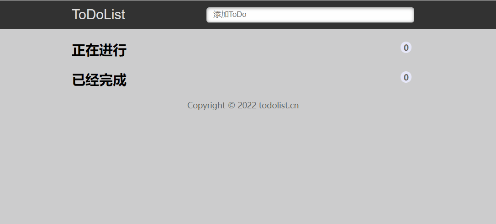
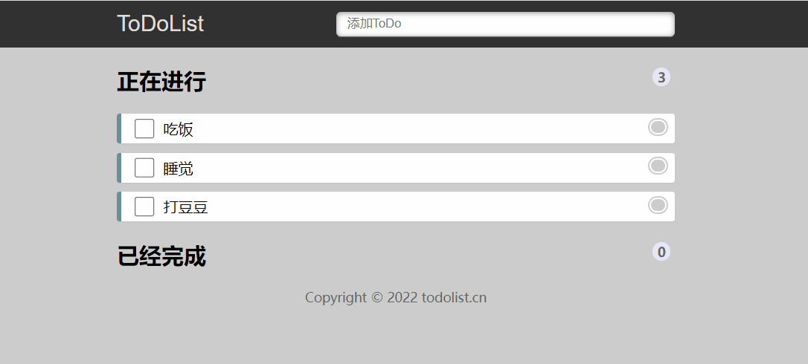
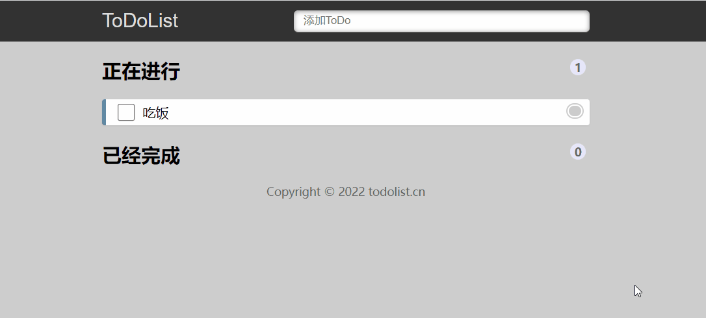
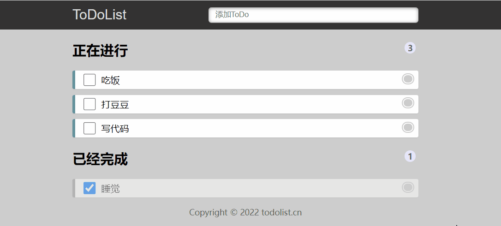
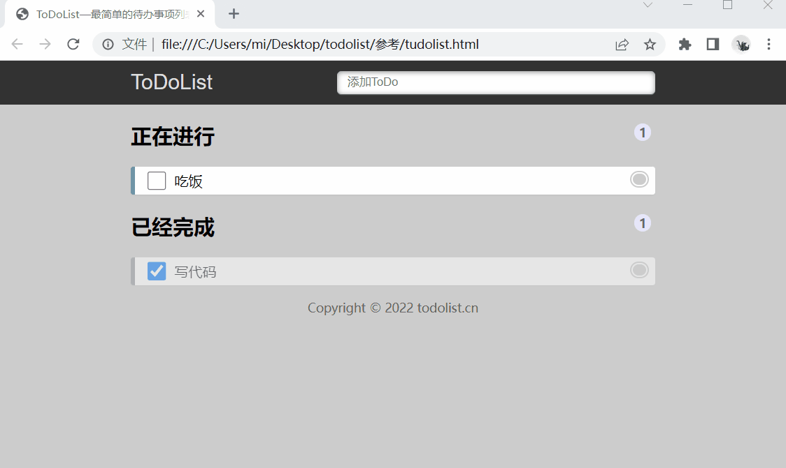

# TodoList

## 一、功能介绍

### 1、创建新任务

在输入框中输入内容，摁下回车键可以创建新任务

### 2、删除任务

点击每个任务的小圆圈，可以删除该任务

### 3、完成任务

点击任务前端复选框，可以标识任务已完成，已完成任务会在“已经完成”区域显示

### 4、标识任务数量

在“新增任务”、“完成任务”、“删除任务”时，及时更新“正在进行”、“已经完成”任务数量

### 5、数据持久化

将任务数据保存在本地存储中，在关闭窗口重新打开时还能展示之前数据

## 二、要求

使用原生js或者jQuery完成